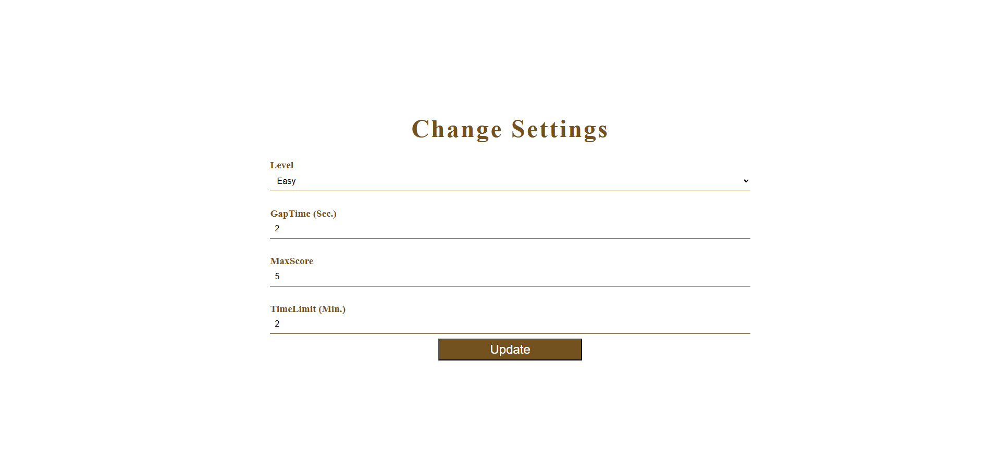
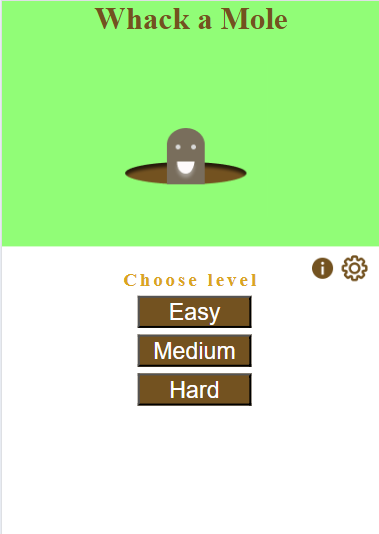
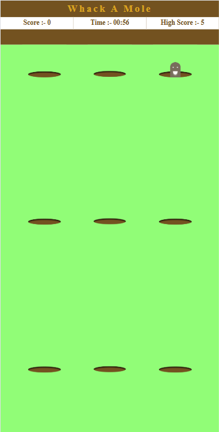
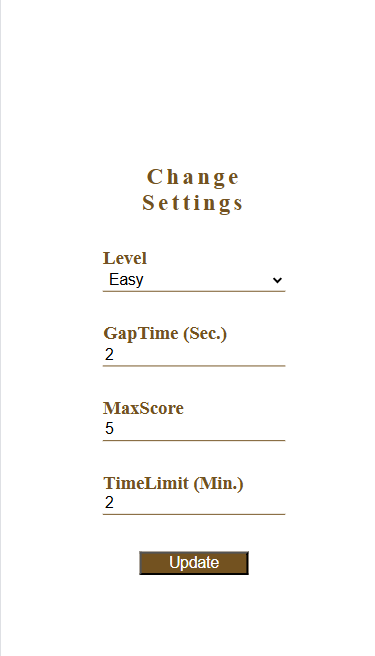

# 🎯 Whack-a-Mole Game (React.js)

A fun and customizable **Whack-a-Mole** game built with **React.js**. Players can tweak difficulty levels by adjusting mole appearance speed and game duration. The game includes smooth animations, real-time scoring, and a responsive layout for both desktop and mobile users.

---

## 🚀 Features

- 🎛️ Adjustable difficulty settings (mole speed, game duration)
- 🐹 Smooth and responsive mole animations
- ⏱️ Game timer with score tracking
- 💻 Optimized for desktop and mobile views
- 🎨 Clean and interactive UI (with ongoing improvements)

---

## 📸 Screenshots

### 🖥️ Desktop Screens

**Home Screen**  


**Playground View**  


**Settings Screen**  


---

### 📱 Mobile Screens

**Home Screen**  


**Playground View**  


**Settings Screen**  



---

## 🛠️ Getting Started

### ✅ Prerequisites

- Node.js (v14 or later)
- npm or yarn

### 📦 Installation

```bash
git clone https://github.com/Daksh-Ashar/ReactJs-Learnings.git
cd ReactJs-Learnings/HitTheMoleGame
npm install
npm start
