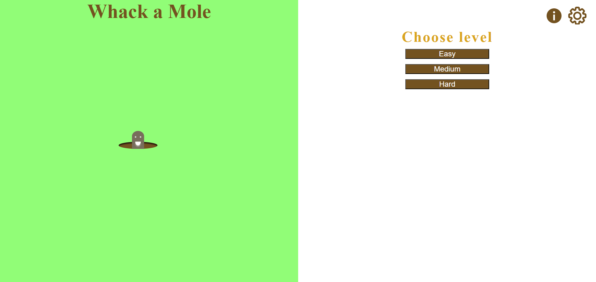
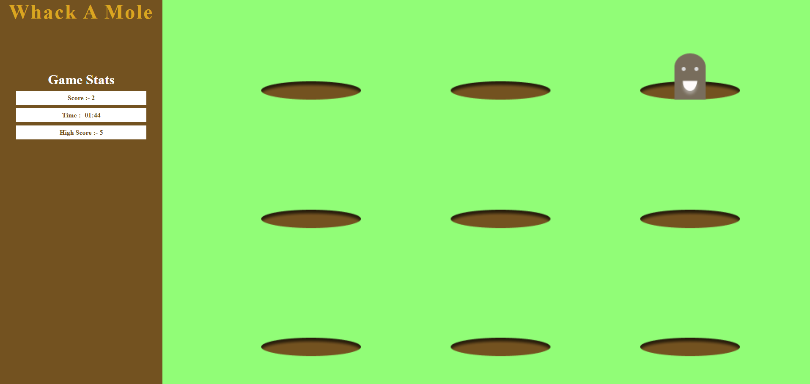
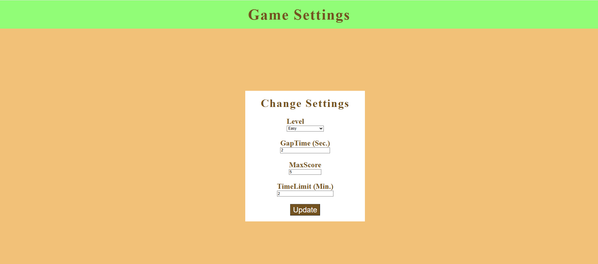

# Whack-a-Mole Game (React.js)

A fun and customizable Whack-a-Mole game built with React.js. Users can adjust difficulty by modifying mole appearance speed and game duration. The game features interactive gameplay with animations and a responsive layout (UI improvements ongoing).

## Features

- Adjustable difficulty settings (mole speed, game duration)
- Smooth animations for mole appearances
- Score tracking and game timer
- Simple and engaging user interface

## Demo

*Add screenshots or a link to a live demo here*

  



## Getting Started

### Prerequisites

- Node.js (v14 or later)
- npm or yarn

### Installation

```bash
git clone https://github.com/Daksh-Ashar/ReactJs-Learnings.git
cd ReactJs-Learnings/HitTheMoleGame
npm install
npm start
```